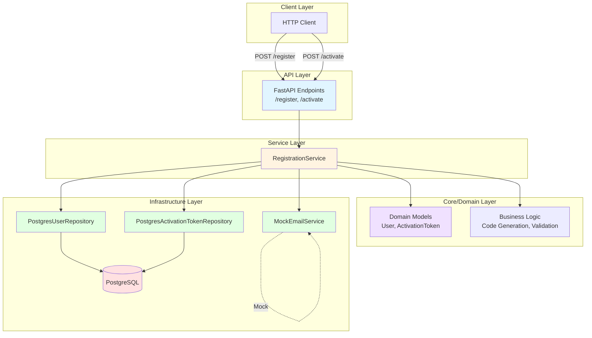

# Building a User Registration API

## Architecture

This project follows a **Layered Architecture (Domain Centric Development)** to ensure a clear separation of concerns, which makes the code
robust, testable and maintainable:

* **API/Presentation:** Handles HTTP requests and responses (FastAPI).
* **Service/Application:** Contains the orchestration logic.
* **Core/Domain:** Contains pure business rules (code expiration, user entities).
* **Infrastructure:** Handles technical details (PostgreSQL Connection Pool, Email Mock).

### Architecture Diagram



## Prerequisites

* Docker and Docker Compose (v2.x)

## Getting started

### 1. Setup Var envs

Create a file named **`.env`** at the project root to securely store database credentials. **Do not omit this file.**

```bash
# .env file content example
DB_NAME=registration_db
DB_USER=myuser
DB_PAWWSORD=password
```

### 2. Launch the Application

the database (PgSQL) and the API service will be started automatically. The database schema will also created upon the first launch.

```bash
docker compose up --build -d
```

The API will be available at `http://localhost:8000`

## API Endpoints

### POST /register

Register a new user with email and password.

**Request:**
```bash
curl -X POST http://localhost:8000/register \
  -H "Content-Type: application/json" \
  -d '{"email": "user@example.com", "password": "SecurePass123"}'
```

**Response:** `201 Created`
```json
{
  "id": "uuid",
  "email": "user@example.com",
  "status": "PENDING"
}
```

### POST /activate

Activate a user account using HTTP Basic Authentication.

**Request:**
```bash
curl -X POST http://localhost:8000/activate \
  -u user@example.com:1234
```

Where:
- `username` = user email
- `password` = 4-digit activation code (sent by email)

**Response:** `200 OK`
```json
{
  "id": "uuid",
  "email": "user@example.com",
  "status": "ACTIVE"
}
```

### GET /health

Health check endpoint to verify API and database connectivity.

**Request:**
```bash
curl http://localhost:8000/health
```

**Response:** `200 OK`
```json
{
  "status": "healthy",
  "database": "connected"
}
```

**Error Response:** `503 Service Unavailable`
```json
{
  "detail": "Database connection failed"
}
```

### 3. Stop the containers

```bash
docker compose down
```

## Available Commands

Most common commands are available through the Makefile for convenience:

```bash
# Build and run
make build          # Build Docker containers
make up             # Start containers in detached mode
make logs           # View application logs

# Testing and code quality
make test           # Run all tests
make lint           # Check code style with ruff
make format         # Format code with ruff
make mypy           # Run type checking with mypy
make check          # Run both lint and mypy checks

# Single command examples
docker compose exec app pytest                    # Run tests
docker compose exec app pytest tests/api/        # Run specific test directory
```

## Testing

To run the entire test suite inside the application containter : 

```bash
docker compose exec app pytest
```

## API Endpoints

The API is fully documented using the **OpenAPI standard (Swagger UI)**. This documentation
provides all necessary details on request schemas, required fields, and response codes.

**Access the interactive documentation**
-   URL : `http://localhost:8000/docs`

